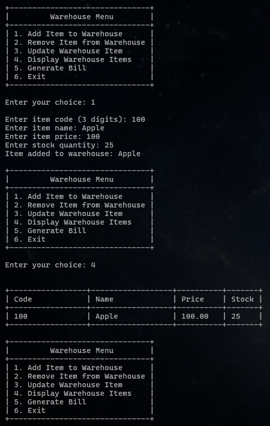

# Invoice Generator

This is a simple Invoice Generator implemented in C. It allows users to create invoices by adding items, specifying quantities, and calculating the total amount.

## Features

*   **Add Item:** Add items to the invoice with details like code, name, price, and quantity.
*   **Generate Bill:** Creates a bill for items being purchased.
*   **Display Items:** Shows all items currently in the invoice.

## Usage

To use the system, compile the `main.c` file and run the executable. Follow the menu options to interact with the invoice generator.